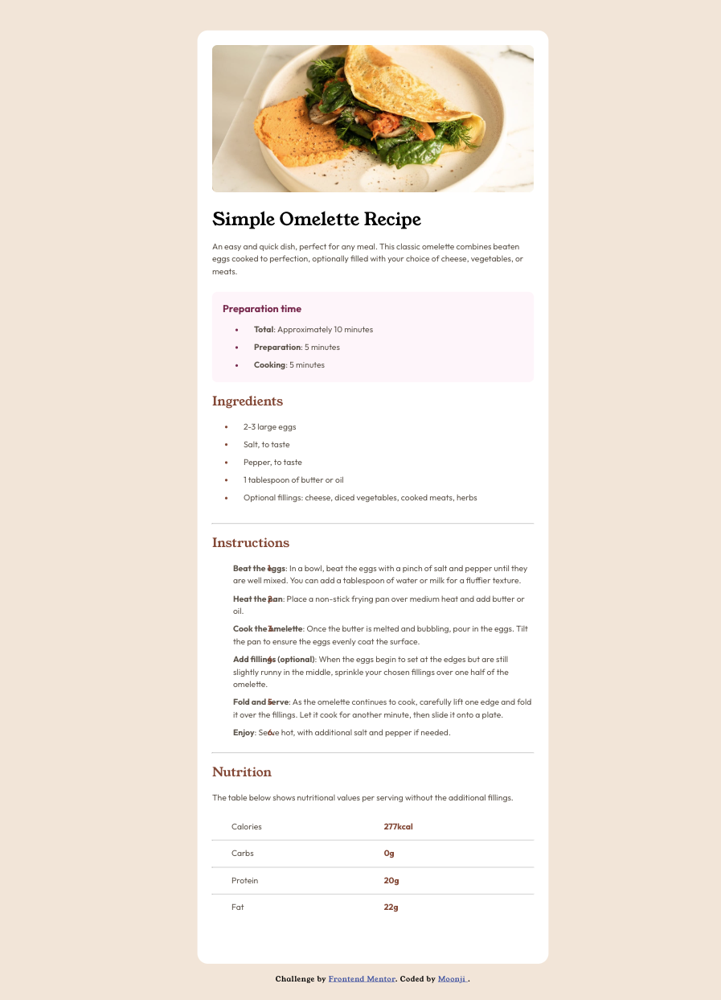
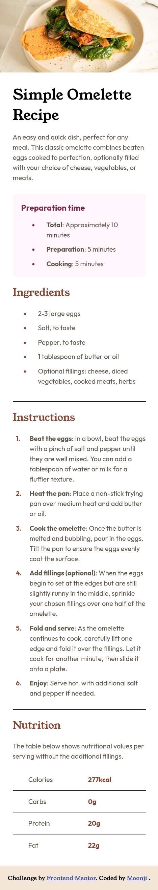

# Frontend Mentor - Recipe page solution

This is a solution to the [Recipe page challenge on Frontend Mentor](https://www.frontendmentor.io/challenges/recipe-page-KiTsR8QQKm). Frontend Mentor challenges help you improve your coding skills by building realistic projects. 

## Table of contents
 
- [Overview](#overview)
  - [The challenge](#the-challenge)
  - [Screenshots](#screenshots)
  - [Links](#links)
- [My process](#my-process)
  - [Built with](#built-with)
  - [What I learned](#what-i-learned)
  - [Continued development](#continued-development)
  - [Useful resources](#useful-resources)
- [Author](#author)

## Overview
### Screenshots
Frontend Mentor's desktop design:


My solution for the desktop design:


Frontend Mentor's mobile design:


My solution for the mobile design:



### Links
- Solution URL: [Recipe Page](https://recipe-page-moonji.netlify.app/)

## My process 
### Built with
- Semantic HTML5 markup
- CSS custom properties
- Flexbox
- CSS Grid

### What I learned
I learned how to style numeric/ordered and bulleted/unordered lists:

```css
/* START OF STYLING THE INSTRUCTIONS NUMBERS */
ol {
    list-style: none;
    counter-reset: item;
}

ol li {
    counter-increment: item;
}

ol li::before {
    content: counter(item) ". ";
    color: var(--brown-800);
    font-weight: 600;
    /* keeps the numbers separate from the other text */
    position: absolute; 
    /* to make the numbers line up beside each of the instructions*/
    left: 36%; 
}
/* END OF STYLING INSTRUCTIONS NUMBERS */


/* set the color of the bullet points to the color of the Ingredients heading */
.ingredients li::marker {
    color:  var(--brown-800);
}

/* set the color of the bullet points to the color of the Preparation Time heading */
.prep-time-section li::marker {
    color: var(--rose-800);
}
```

### Continued development
I'd like to focus on positioning with responsive design in the future so components don't look or behave weirdly lol.

### Useful resources
- [ MDN Web Docs: ::marker ](https://developer.mozilla.org/en-US/docs/Web/CSS/::marker) - This helped me learn how to use the ::marker pseudo-element which selects the marker box of a list item, which typically contains a bullet or number and can change it to an image or symbol.
- [ MDN Web Docs: position ](https://developer.mozilla.org/en-US/docs/Web/CSS/position) - This helped me learn how to position items/components with position and top, left, right, bottom, like this: 

      position: absolute;
      top: 40px; 
      left: 20px;

## Author
- Frontend Mentor - [@moonji-spoonji](https://www.frontendmentor.io/profile/moonji-spoonji)

